# Squadcast Webhook Connectors

This repository contains the code for the Squadcast Webhook Connectors and is intended to be used along with Event Hooks.
The repository supports : 
1. Slack
2. Discord
3. Trello
4. Click Up
5. Telegram
6. Email


## Prerequisites
- git
- NodeJs | npm
- nodemon
### Tip : For Linux Users, just execute the command below to install all the NodeJS prerequisites
```
bash dependencies.sh
```

## Authentication

Squadcast Webhook Connectors has authentication built-in. Users can choose between a user defined authKey or an automatically generated authKey.

* User Defined authKey :-
Inside the .env file, users need to define the `authKey` and change the `useAuthKey` variable’s value to “yes”.
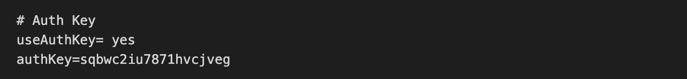

* Auto generated authKey :-
Once the Node Server is up and running, an `authKey` will be provided.
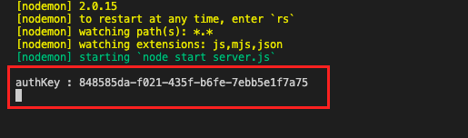

    ***Note** : Make sure that inside the .env file, `useAuthKey` variable’s value is “no”*

Users need to add `authKey` in the headers section of the Squadcast's Outgoing Webhooks. Eg. :
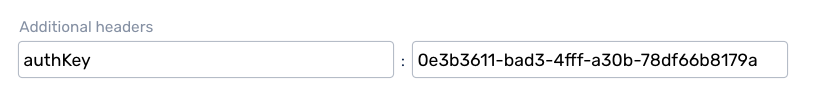

## Getting Started
 - Clone this repo
```sh
git clone https://github.com/highlyUnderrated/Squadcast-Webhook-Connectors
```
- Install dependencies
```sh
npm install
```
- Run
```sh
nodemon start
```
----
----
----
## Use Cases

### Slack
----

> URL : https://Server-IP-Address:5000/squadcast/connector/slack

Request Headers :- 
* Slack URL can support multiple channels. To notify channels, just put integers as name of Key value pair & value should be the Slack Webhook. Eg. :
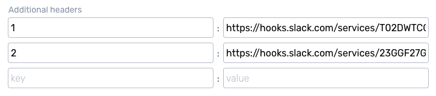

### Discord
----

> URL : https://Server-IP-Address:5000/squadcast/connector/discord

Request Headers :- 
* Discord URL can support multiple channels. To notify channels, just put integers as name of Key value pair & value should be the Discord Webhook. Eg. :
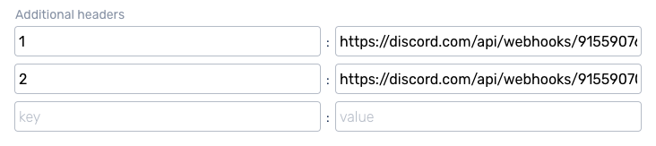

### Trello
----

> URL : https://Server-IP-Address:5000/squadcast/connector/trello

Request Headers :- 
* To use the Trello webhook, just paste the URL mentioned above in Squadcast Webhook URl box. In the headers, just add "idList", "key" & "token" and their proper values. Eg. : 
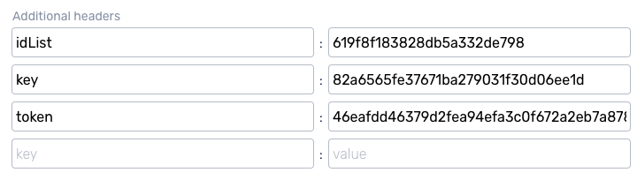

* To see your idList, Open a card > Click on Share > Click on Export Json > You'll see a JSON which will contain idList.
* 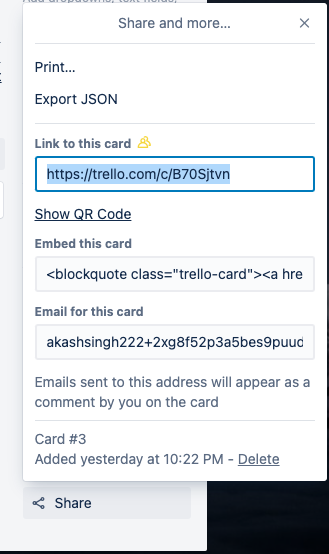
* Tip : To get you own token & key, navigate to : https://trello.com/app-key


### Telegram
----

> URL : https://Server-IP-Address:5000/squadcast/connector/telegram

Steps :-
1. `Important` : Before starting, create your own Telegram Bot : https://core.telegram.org/bots#6-botfather
2. Paste the Telegram Bot Token in the `telegram_bot_token` in .env file. Also change the `telegram_bot_start` variable's value to "yes". Eg. : 
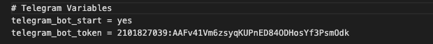
3. Now you can start the server, Refer Getting Started - Step 3.
4. To use the Telegram webhook, just paste the URL mentioned above in Squadcast Webhook URl box. In the headers, just add "chatId" and its proper value. Eg. : 
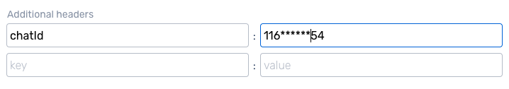
* Tip : To get you own chatId, follow this article : https://www.alphr.com/find-chat-id-telegram/


### Click Up
----

> URL : https://Server-IP-Address:5000/squadcast/connector/clickup

Request Headers :- 
* To use the Click Up webhook, just paste the URL mentioned above in Squadcast Webhook URl box. In the headers, just add "listId", "token" & "priority" and their proper values. Eg. : 
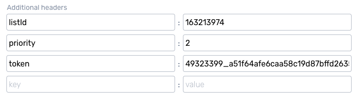
* `Important` : Priority is a number that corresponds to the Priorities available in the ClickUp UI. As in the ClickUp UI, priorities cannot be customized.1 is Urgent, 2 is High, 3 is Normal & 4 is Low.
* Tip : To get your own Access Token & listId, refer https://jsapi.apiary.io/apis/clickup20/introduction/authentication.html

### Email
----

> URL : https://Server-IP-Address:5000/squadcast/connector/email

Request Headers :- 
* To use the email webhook, just paste the URL mentioned above in Squadcast Webhook URl box. In the headers, just add "from_email", "from_password", "to_email" & "SMTP" and their proper values. Eg. : 
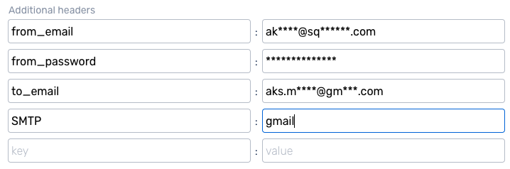

List of SMTP Providers Supported : -
* Service names are case insensitive : 
"126"
"163"
"1und1"
"AOL"
"DebugMail"
"DynectEmail"
"FastMail"
"GandiMail"
"Gmail"
"Godaddy"
"GodaddyAsia"
"GodaddyEurope"
"hot.ee"
"Hotmail"
"iCloud"
"mail.ee"
"Mail.ru"
"Maildev"
"Mailgun"
"Mailjet"
"Mailosaur"
"Mandrill"
"Naver"
"OpenMailBox"
"Outlook365"
"Postmark"
"QQ"
"QQex"
"SendCloud"
"SendGrid"
"SendinBlue"
"SendPulse"
"SES"
"SES-US-EAST-1"
"SES-US-WEST-2"
"SES-EU-WEST-1"
"Sparkpost"
"Yahoo"
"Yandex"
"Zoho"
"qiye.aliyun"